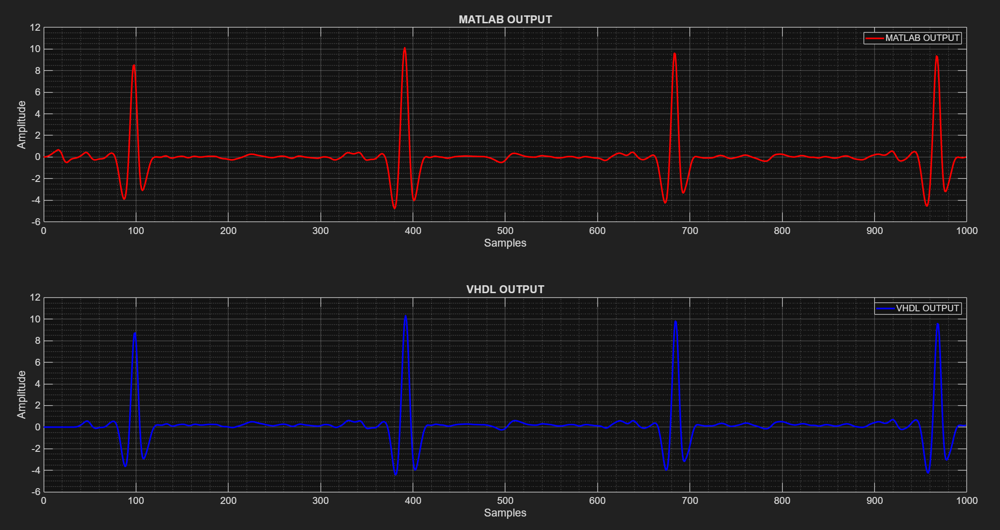
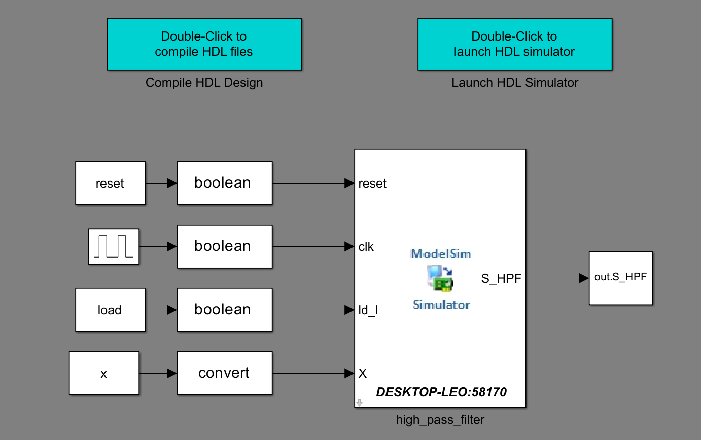

# HIGH-PASS VHDL FILTER – Pan-Tompkins Algorithm

This repository presents the implementation and validation of a **high-pass filter** based on the **classical Pan-Tompkins algorithm**, using **explicit coefficients** and a **recursive structure**, with a strong focus on **MATLAB and VHDL compatibility** for **biomedical signal processing (ECG)** and **VLSI architectures**.

The project follows a **software-to-hardware validation flow**, widely adopted in academic research and embedded system design.

---

## 📌 Objective

- Implement the **Pan-Tompkins high-pass filter** in a way that is:
  - Faithful to the original paper
  - Structurally compatible with hardware implementations
  - Directly validated in MATLAB using `filter(b,a,x)`
- Enable **straightforward translation to VHDL**
- Support functional comparison between:
  - MATLAB results
  - HDL simulations (ModelSim / Questa)

---

## 📐 Theoretical Background

The Pan-Tompkins high-pass filter can be described by the following discrete-time equation:

\[
y[n] = y[n-1] - \frac{1}{32}x[n] + x[n-16] - x[n-17] + \frac{1}{32}x[n-32]
\]

Which corresponds to the transfer function:

\[
H_{HP}(z) = z^{-16} - \frac{1}{32}\frac{1 - z^{-32}}{1 - z^{-1}}
\]

This formulation enables an efficient hardware implementation using **adders, registers, and delay elements**, without requiring complex multipliers.

---

### MATLAB vs VHDL Output Comparison



### Co-Simulation Overview



---

## 🧠 MATLAB Implementation

The filter is implemented using explicit coefficients:

```matlab
b = zeros(1,33);
b(1)   = -1/32;
b(17)  = 1;
b(18)  = -1;
b(33)  = 1/32;

a = [1 -1];

y_hp = filter(b, a, x);

```text
HIGH-PASS-VHDL-FILTER-PTA/
│
├── data/
│   └── LPF_OUT.mat        # Input signal (Low-Pass filter output)
│
├── fig/
│   ├── fig1.png           # Time-domain and analysis plots
│   └── fig2.png
│
├── src/
│   ├── main_EN_US.m       # Main script (English)
│   └── main_PT_BR.m       # Main script (Portuguese)
│
├── vhdl/
│   └── High_pass_filter.vhd  # VHDL implementation of the filter
│
├── cosim_link/            # MATLAB ↔ HDL co-simulation (optional)
├── startup.m              # Environment initialization script
├── README.md              # Project documentation
└── .gitignore
```

## Run Project

This section describes the steps required to run the project, generate the reference results in MATLAB, and validate the VHDL implementation through co-simulation.

### Requirements

- MATLAB (with Simulink)
- HDL Verifier Toolbox
- ModelSim or QuestaSim properly installed and configured
- Compatible VHDL simulator path added to MATLAB

---

### Step 1 – MATLAB Initialization

Open MATLAB in the **root directory of the project** and run:

```matlab
startup.m
```

### Step 2 – Run the Main MATLAB Script

Execute the main script in English:

```matlab
main_EN_US.m
```

This script performs the following operations automatically:

- Loads ECG data filtered from early stage LPF from the MIT-BIH database
- Generates stimulus signals:
- Impulse response
- Step response
- Checks and normalizes the input signal
- Computes the high-pass filter reference output in MATLAB
- Plots input and output signals for verification

### Step 3 – Co-Simulation Setup (First Run Only)

If this is the first execution on a given machine:

Navigate to the co-simulation folder:

```matlab
cd ('cosim_link');
```

Launch the Cosimulation Wizard:

```matlab
cosimWizard
```

Configure the wizard with:

- VHDL simulator executable path

- Top-level VHDL entity (High_pass_filter)

- Fixed-point output format (signed, fractional bits as required)

### Step 4 – Run Co-Simulation Testbench

From MATLAB:

```matlab
open('cosim_link/LPF_IMP_STEP_test.slx')
```
Run the Simulink model to:

- Apply the same impulse and step stimuli to the VHDL design
- Capture the VHDL output
- Export results back to MATLAB workspace

### Step 5 – Result Comparison

After simulation, the script automatically:

- Plots MATLAB reference output
- Plots VHDL output
- Displays a side-by-side comparison for visual validation
- Matching waveforms confirm the functional equivalence between the MATLAB model and the VHDL implementation.

Notes

All signals are handled in fixed-point format on the VHDL side.

The design is fully synchronous and suitable for FPGA or ASIC synthesis.

The project structure allows easy extension to additional Pan–Tompkins stages.

## Processing Flow

- ECG signal input filtered through a low-pass filter
- High-pass filtering in MATLAB
- Time and frequency-domain analysis
- Structural implementation in VHDL
- Co-simulation and functional validation

## pplications

- QRS detection (Pan-Tompkins algorithm)
- Low-power VLSI architectures
- Wearable and medical devices
- Academic research and DSP education

## Important Notes

- The filter is not zero-phase and introduces group delay, as in the original algorithm
- The delay is acceptable for event detection (QRS complexes)
- The structure is optimized for hardware efficiency, not for high-fidelity audio processing

## Reference

Pan, J., & Tompkins, W. J. (1985). A Real-Time QRS Detection Algorithm. IEEE Transactions on Biomedical Engineering, BME-32(3), 230–236.